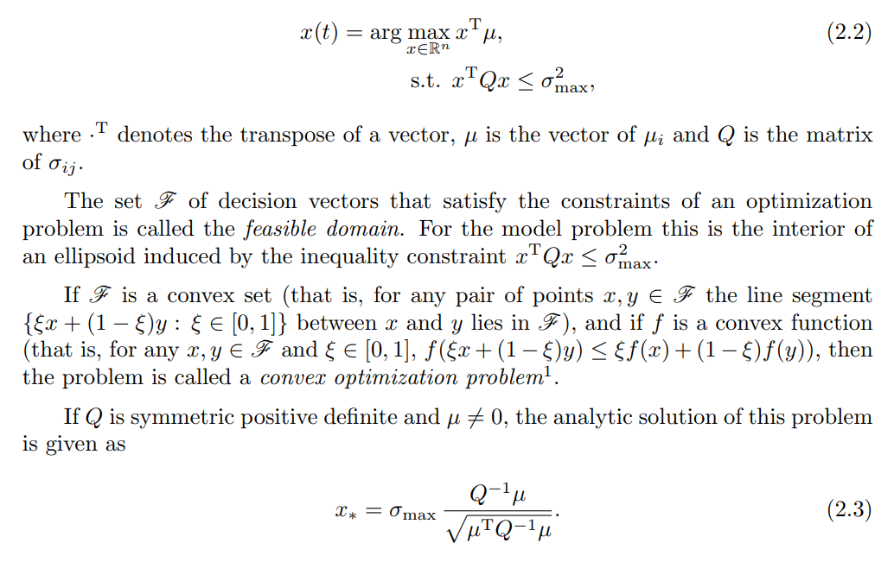

# Intermezzo: Risk vs. Cash

## Univariate Trading systems

$$\mathrm{Cash\;Position} = G \times \mu \oslash \mathrm{Volatility}$$

Here $\oslash$ denotes the element-wise division of two vectors of the same length.
The vector $\mu$ is a prediction for the volatility adjusted return.
The constant $G$ is a scaling factor.

* Hedge funds embrace the construction of powerful $\mu$. Quant Researchers, Traders
* Less effort is put into constructing a good measure for Volatility
  (often based on high-frequency data). Volatility shouldn't be too nervous but
  nevertheless respond fast.
* Combination of many such individual systems often considered to be a pure IT
  problem. Risk Managers or Committee.

## Risk vs. Cash

* Asset allocation can be done both in **risk** or in **cash** space. Both approaches
  are equivalent.
* The risk (variance) of the portfolio is

$$
c^T\,\mathbf{Cov}\,c
= (c \odot \mathrm{Volatility})^T \mathbf{Cor}\,( \mathrm{Volatility} \odot c)
= x^T \mathbf{Cor}\,x
$$

* The condition number for $\mathbf{Cor}$ is lower than the condition number
  for $\mathbf{Cov}$.
* The entries of $x$ will spread less than the entries in $c$.
* The entries of $x$ bear more insight than the entries of $c$.

## Expected return

$$
(c \odot \mathrm{Volatility})^T \mu = x^T \mu
$$

## Risk

$$
x^T \mathbf{Cor}\,x
$$

## Optimization

